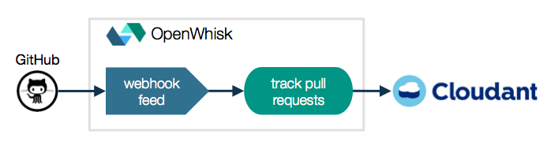
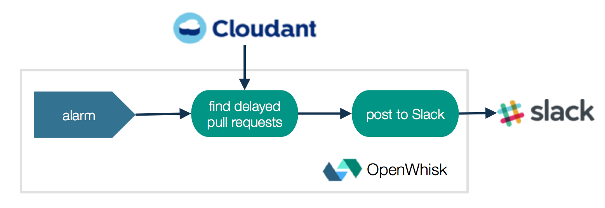
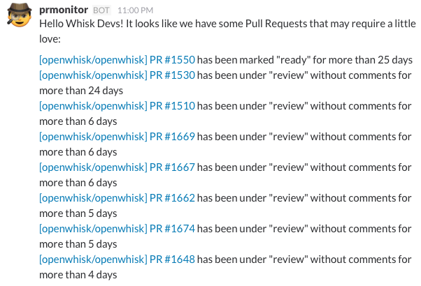
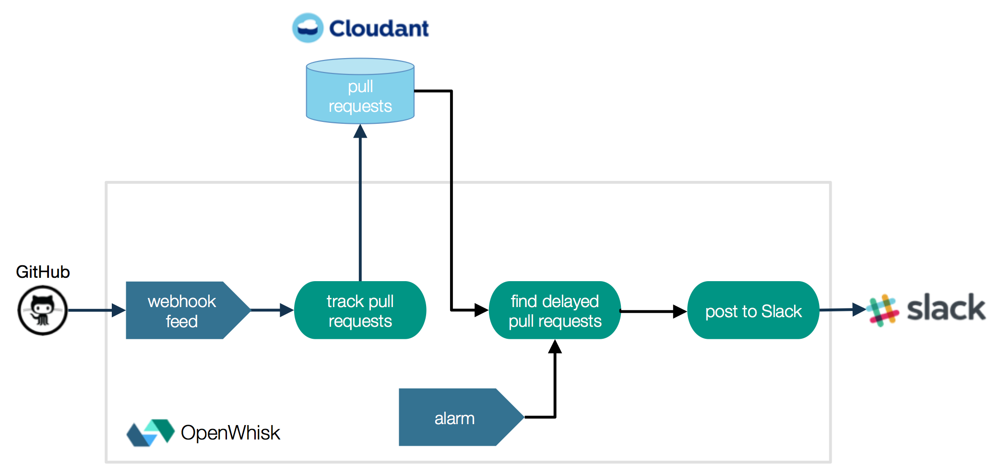
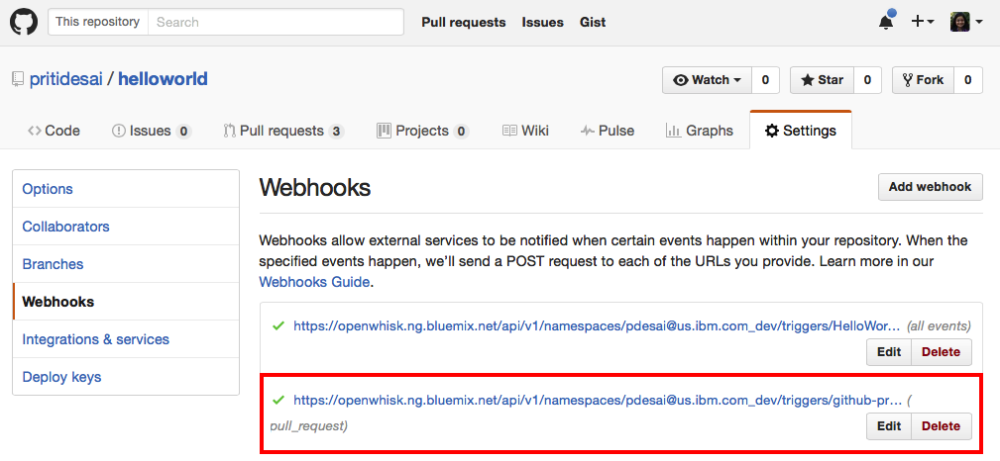
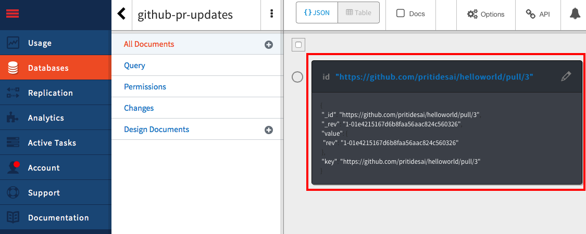

# GitHub Slack Bot

The *GitHub Slack Bot* is a serverless, event-driven, bot designed and built using the [OpenWhisk open source project](http://openwhisk.org/).

This bot is designed to post updates to Slack when a GitHub pull request is ready to merge or a list of pull requests are under review for certain days and haven't merged.

## Architecture 

The GitHub Slack Bot is built on a set of three actions (like microservices) which are invoked either by some triggers or by another action in a sequence of dependent actions. One action is invoked by regular pulll request updates received from a GitHub repository and an action sequence (consisting of two actions) is triggered periodically by an internal OpenWhisk alarm (similar to a cron job).

Each of the actions in GitHub Slack Bot are implemented in JavaScript, using the Node.js runtime provided by OpenWhisk on Bluemix. Here’s what each action does within its triggered flow.

### Invoked by GitHub repository when any pull request changes

* **Track pull requests** - An action that is subscribed to "pull_request" events on GitHub repository. GitHub repository sends pull request payload via HTTP POST which is stored in Cloudant to form a data set of pull requests. Data set in Cloudant is updated when a pull request is:

  * labeled "ready" or "review" or
  * unlabeled ("ready" or "review" label is removed) or
  * updated due to a new push in the branch that the pull request is tracking or
  * closed



### Invoked twice a day by an Alarm trigger

The sequence of actions is invoked by Alarm trigger, which then starts a chain of microservices to retrieve list of delayed pull requests and compose notifications which are posted on Slack.

* **Find delayed pull requests** - an action that is invoked every 12 hours with Cloudant data set, retrieves a list of pull requests which are ready to be merged and older than certain days.   

* **Post to Slack** - an action invoked by _find delayed pull requests_ action. It takes a list delayed pull requests and composes message with pull requests, ID, label, and age in days to post on Slack.



Finally, here is the sample message posted on Slack showing list of delayed pull requrests from OpenWhisk repo. OpenWhisk project developers at IBM are using this bot to receive such notifications.



### Bringing it all together

So to summarize, this is how all three actions are configured to post notifications on Slack:


 
## Installation

If you would like to try this yourself, here are the detailed instructions to follow. You will need an account on [IBM Bluemix](https://console.ng.bluemix.net).

### Prerequisite

* Setup OpenWhisk CLI

Follow the [instructions](https://console.ng.bluemix.net/openwhisk/learn/cli) on IBM Bluemix to setup OpenWhisk CLI. Set your API host and auth key with:

```bash
wsk property set --apihost openwhisk.ng.bluemix.net --auth <user>:<pass>
```
* Clone this repo:

```bash
git clone git@github.com:openwhisk/openwhisk-GitHubSlackBot.git
cd openwhisk-GitHubSlackBot
```
* Export namespace

```bash
export OPENWHISK_NAMESPACE=`wsk property get --namespace | awk '{printf("%s", $3)}'`
```

### Step 1: Create Cloudant Service

If you don't have one already, create a new Cloudant NoSQL database by following tutorial on [Creating a Cloudant instance on Bluemix](https://console.ng.bluemix.net/docs/services/Cloudant/tutorials/create_service.html#creating-a-cloudant-instance-on-bluemix) or [GitHub IBM Bluemix docs](https://github.com/IBM-Bluemix/docs/blob/master/services/Cloudant/tutorials/create_service.md).

Also, [create a new database](docs/images/Step1-CreateANewDatabase.png) if you don't have one.

### Step 2: Create Cloudant Package Binding - TrackPRsInCloudant

Get the Cloudant [Service Credentials](https://github.com/IBM-Bluemix/docs/blob/master/services/Cloudant/tutorials/images/img0009.png) from Step 1.


```bash
cat cloudant.json
{
  "username": "<username>",
  "password": "<password>",
  "host": "<host>",
  "port": <port>,
  "url": "<url>",
  "dbname": "<dbname>"
}
wsk package bind /whisk.system/cloudant TrackPRsInCloudant --param-file cloudant.json
```

This will result in a cloudant package and you can verify by running a sample action:

```bash
wsk action invoke TrackPRsInCloudant/list-documents --blocking
```

### Step 3: Create an Action - track-pull-requests

```bash
wsk action create track-pull-requests openwhisk/actions/js/track-pull-requests.js --param cloudant_package TrackPRsInCloudant
```

### Step 4: Create GitHub WebHook trigger - GitHubWebHookTrigger

 1. Generate GitHub [Personal Access Token](https://help.github.com/articles/creating-an-access-token-for-command-line-use/).
 2. Create a GitHub Package Binding:

 ```bash
 cat github.json
 {
   "username": "<username>",
   "repository": "<repository>",
   "accessToken": "<accessToken>"
}
 wsk package bind /whisk.system/github GitHubWebHook --param-file github.json
 ```
 
 3. Create a WebHook trigger for the GitHub **pull-request** by using PACKAGE/webhook feed created in Step 2:

 ```bash
 wsk trigger create GitHubWebHookTrigger --feed GitHubWebHook/webhook --param events pull-request
 ```

 4. GitHub sends a "ping" to the new webhook as part of the webhook creation. This can be used to verify that the trigger is actually fired with:
 
 ```bash
 wsk activation list GitHubWebHookTrigger
 ```
 
 And creates a webhook under GitHub repository, for example:
  
 

### Step 5: Create a Rule - RuleToTrackPullRequests

```bash
wsk rule create RuleToTrackPullRequests /$OPENWHISK_NAMESPACE/GitHubWebHookTrigger /$OPENWHISK_NAMESPACE/track-pull-requests
```

At this point, any new pull request update is being recorded in Cloudant database, for example:



### Step 6: Create an Action - find-delayed-pull-requests

```bash
cat find-delayed-pull-requests.json
{
  "cloudant_package": "TrackPRsInCloudant",
  "github_username": "<github_username>",
  "github_access_token": "<github_access_token>"
}
wsk action create find-delayed-pull-requests openwhisk/actions/js/find-delayed-pull-requests.js --param-file find-delayed-pull-requests.json
```
If you would like to verify action creation, you can run it with:

```bash
wsk action invoke find-delayed-pull-requests --blocking
...
    "response": {
        "status": "success",
        "statusCode": 0,
        "success": true,
        "result": {
            "prs": []
        }
    },
...    
```

### Step 7: Add Incoming Webhook to Slack

Create a new incoming webhook by following step by step instructions from [here](docs/add-webhook-to-slack.md).

### Step 8: Create Slack Package Binding - PostPRToSlack

```bash
cat slack.json
{
  "username": "<username>",
  "url": "<url>",
  "channel": "#<channel>"
}
wsk package bind /whisk.system/slack PostPRToSlack --param-file slack.json
```

You can verify by posting a sample message to your Slack channel:

```bash
wsk action invoke PostPRToSlack/post  --blocking --result --param text "Hello World"
```

### Step 9: Create an Action - post-to-slack

```bash
wsk action create post-to-slack openwhisk/actions/js/post-to-slack.js --param slack_package PostPRToSlack
```

### Step 10: Create an Action Sequence - SequenceToPostGitHubPRsToSlack

```bash
wsk action create SequenceToPostGitHubPRsToSlack --sequence /$OPENWHISK_NAMESPACE/find-delayed-pull-requests,/$OPENWHISK_NAMESPACE/post-to-slack
```

### Step 11: Create Alarm Trigger - Every12Hours

```bash
wsk trigger create Every12Hours --feed /whisk.system/alarms/alarm --param cron "0 */12 * * *"
```

### Step 12: Create a Rule - RuleToPostGitHubPRsToSlack

```bash
wsk rule create RuleToPostGitHubPRsToSlack /$OPENWHISK_NAMESPACE/Every12Hours /$OPENWHISK_NAMESPACE/SequenceToPostGitHubPRsToSlack
```

You can fire alarm trigger to verify:

```bash
wsk trigger fire /$OPENWHISK_NAMESPACE/Every12Hours
```
