# GitHubSlackBot using IBM Bluemix

## Step 1: Create Cloudant Service - GitHubSlackBotCloudant

If you don't have one already, create a new Cloudant NoSQL database by following tutorial on [Creating a Cloudant instance on Bluemix](https://console.ng.bluemix.net/docs/services/Cloudant/tutorials/create_service.html#creating-a-cloudant-instance-on-bluemix) or [GitHub IBM Bluemix docs](https://github.com/IBM-Bluemix/docs/blob/master/services/Cloudant/tutorials/create_service.md).

Also, [create a new database](images/Step1-CreateANewDatabase.png) if you don't have one.

## Step 2: Create Cloudant Package Binding - TrackPRsInCloudant

On IBM Bluemix portal, select **"Browse Public Packages"** to create a new cloudant package.

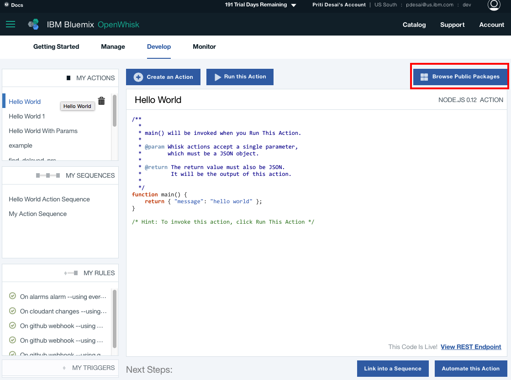

Select **"Cloudant"**:

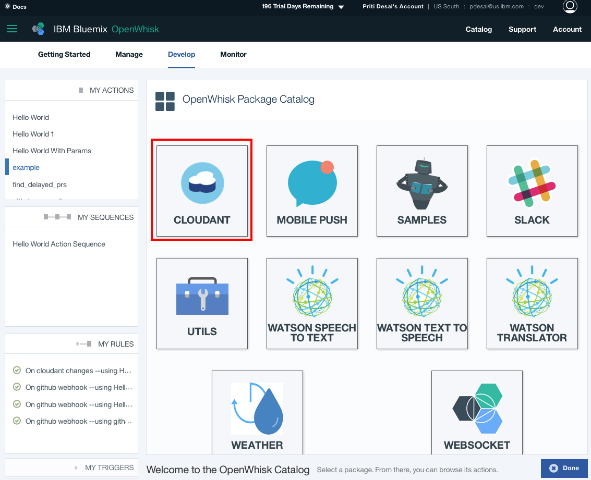

Select **"Create document"** action:

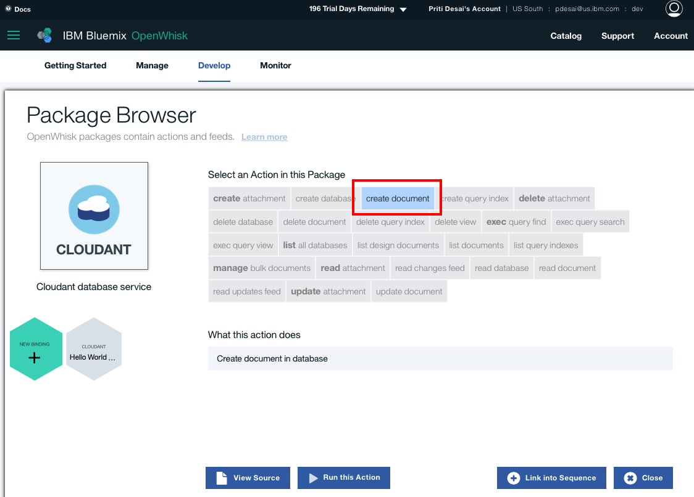

Select Cloudant instance we just created in previous step named **"GitHubSlackBotCloudant"** and database you created.

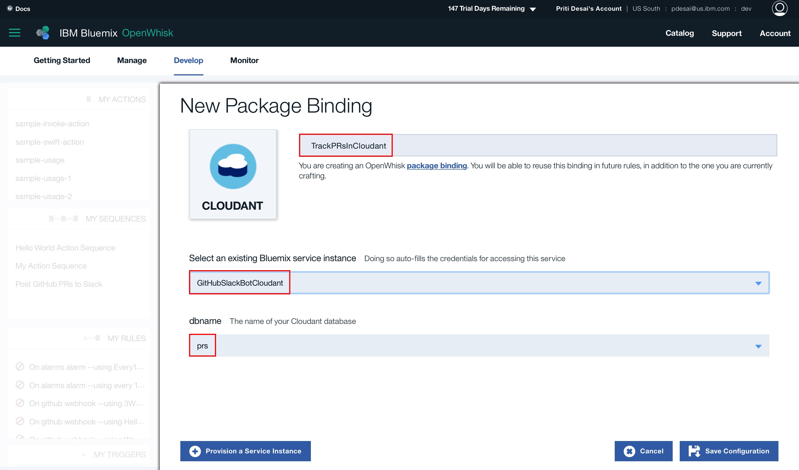

It creates a new package **"TrackPRsInCloudant"** and you can view the details:

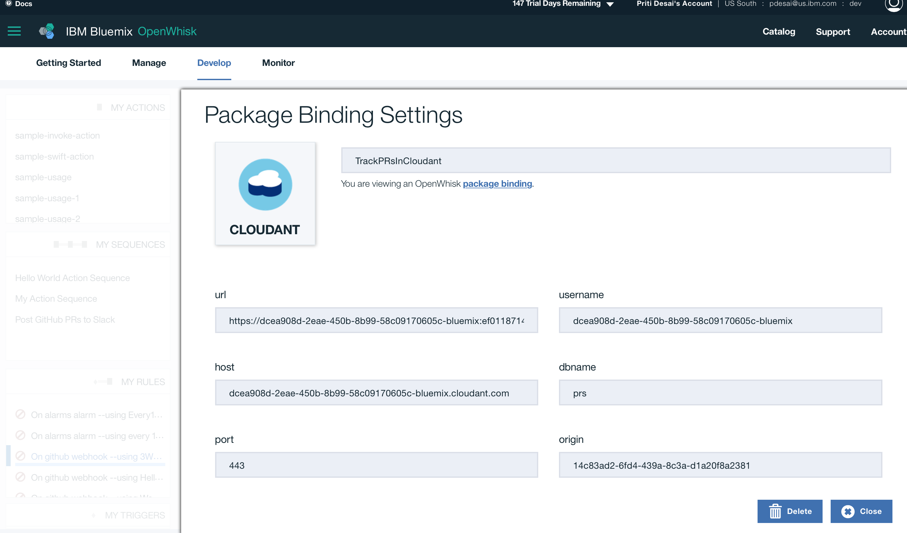

## Step 3 - Create an Action - track-pull-requests

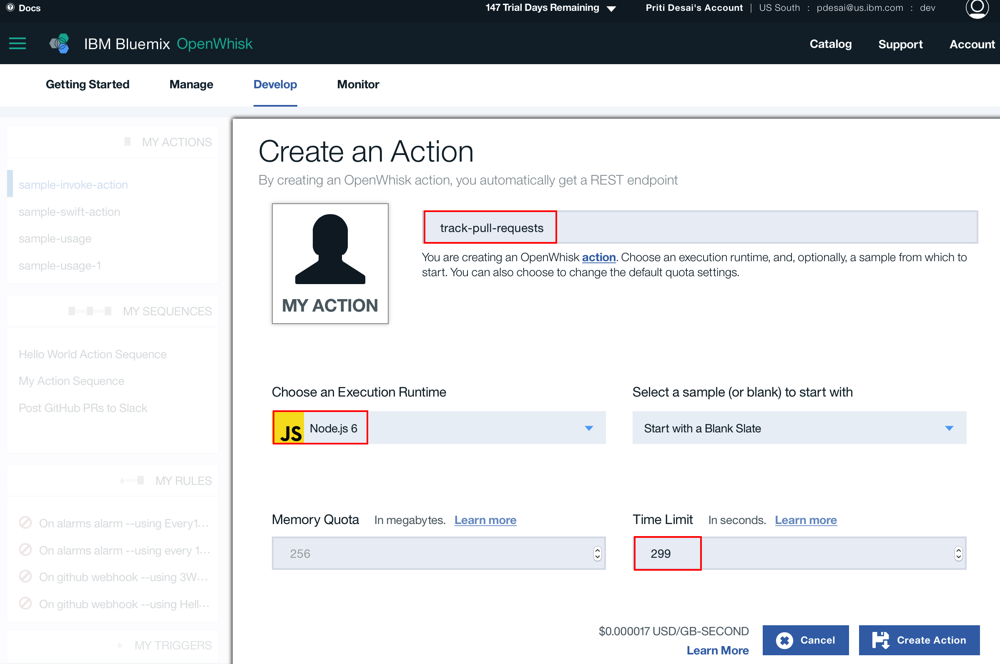

Creating an action here results in a **track-pull-requests.js** file with:

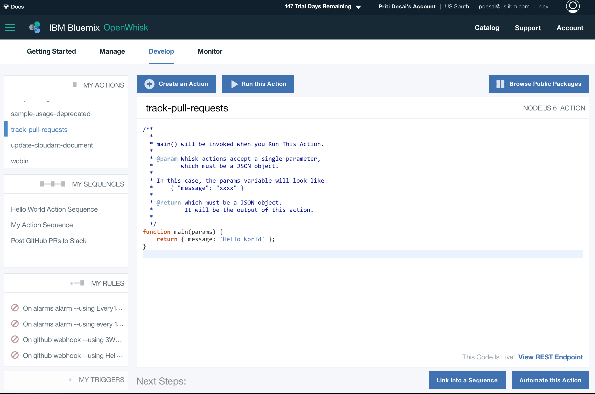

Now, copy code from [track-pull-requests.js](../openwhisk/actions/js/track-pull-requests.js) and paste it here.

## Step 4 - Create GitHub WebHook trigger - GitHubWebHookTrigger

Create trigger using **"Automate this Action"** option and select **"GitHub WebHook"**:

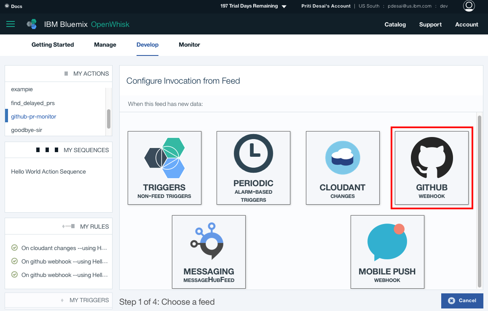

Add a new trigger using **"New Trigger"**:

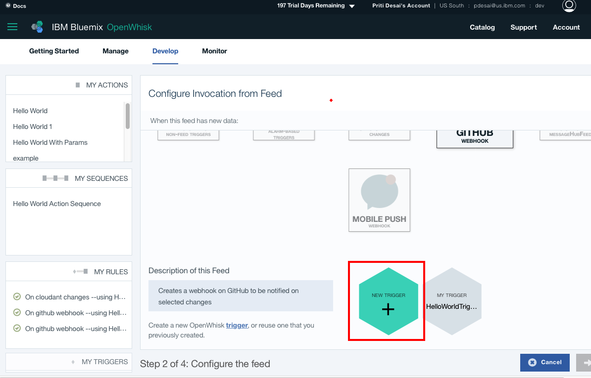

Creating a new trigger takes following parameters:

* Trigger Name: Name Your Trigger
* Your GitHub username: GitHub Username
* accessToken: Access Token
* GitHub Repository: GitHub Repo Name
* Events: pull-request

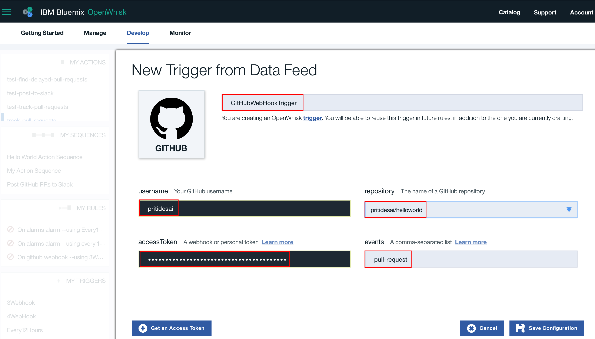

GitHub WebHook trigger adds a new webhook to GitHub repo:

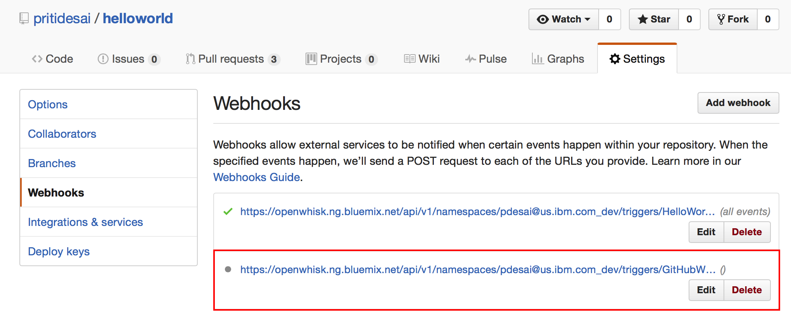

## Step 5 - Create a Rule - RuleToTrackPullRequests

Now, create a rule so that **"track-pull-requests"** can be invoked by GitHub WebHook trigger **"GitHubWebHookTrigger"**.

## Step 6: Create an Action - find-delayed-pull-requests

## Step 7: Add Incoming Webhook to Slack

## Step 8: Create Slack Package Binding - PostPRToSlack

## Step 9: Create an Action - post-to-slack

## Step 10: Create an Action Sequence - SequenceToPostGitHubPRsToSlack

## Step 11: Create Alarm Trigger - Every12Hours

## Step 12: Create a Rule - RuleToPostGitHubPRsToSlack

