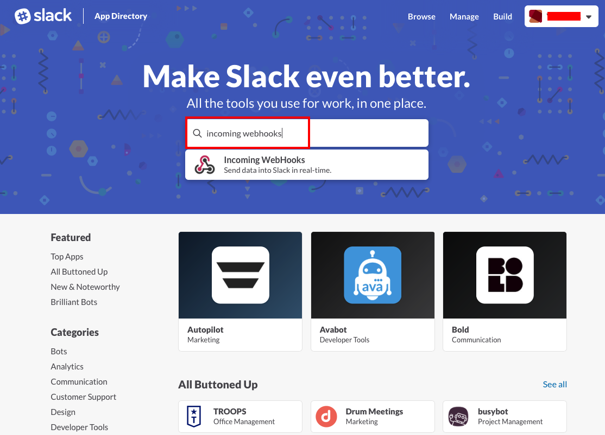
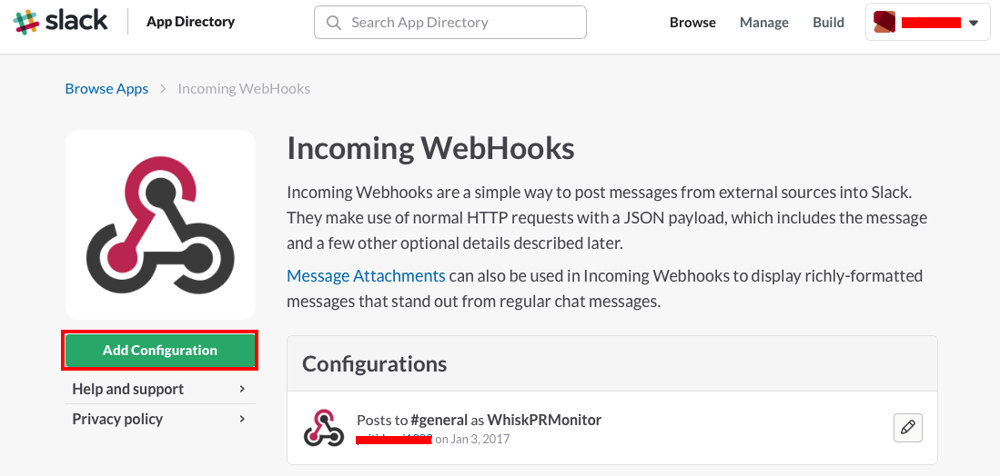
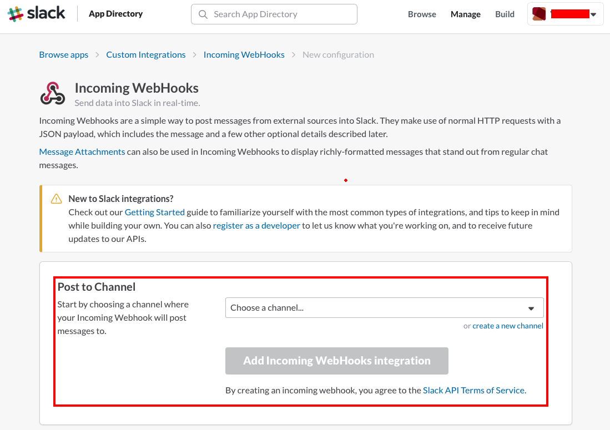
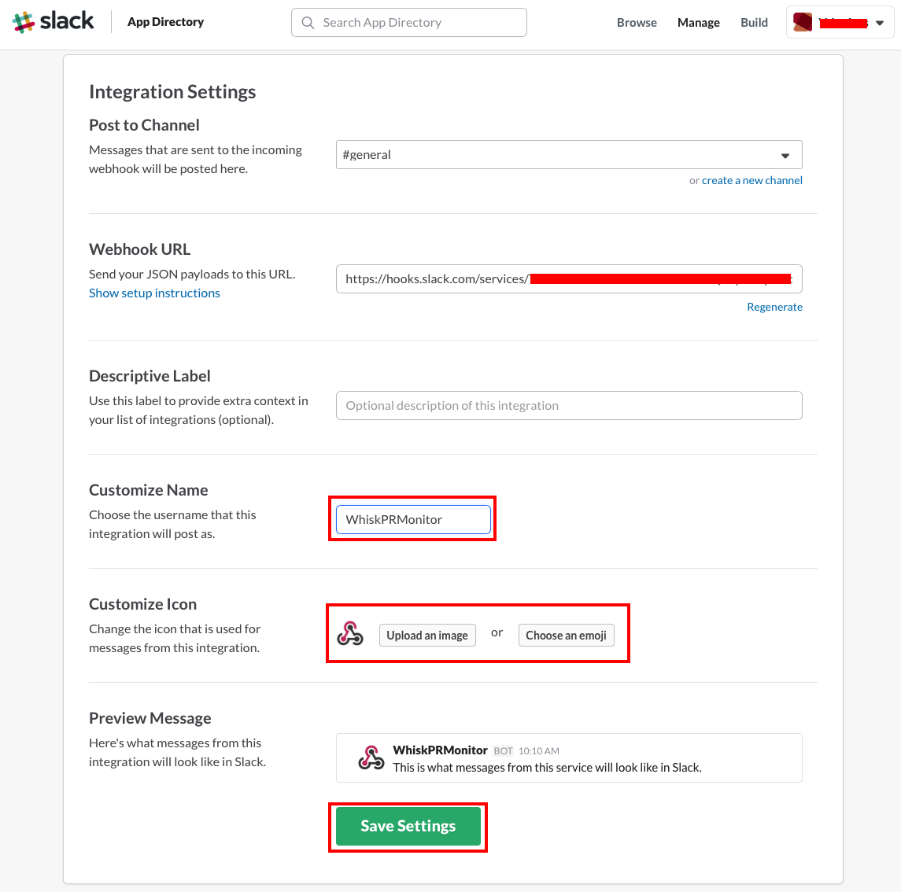

# Add Incoming Webhook to Slack

Here are the instructions to create a new webhook in Slack. This incoming webhook is needed for an OpenWhisk action to post messages to Slack.

1. Under **"Apps & Integrations"**, search for **"Incoming Webhooks"**:

 

2. Add a new WebHook using **"Add Configuration"**:

 
 
3. Choose a desired channel with the dropdown box **"Choose a channel"** or **"create a new channel"** followed by **"Add Incoming WebHooks integration"**:

 
 
4. Under **"Integration Settings"**, make note of **"Webhook URL"** which will be used in next step. You can customize username and icon with **"Customize Name"** and **"Customize Icon"**:

